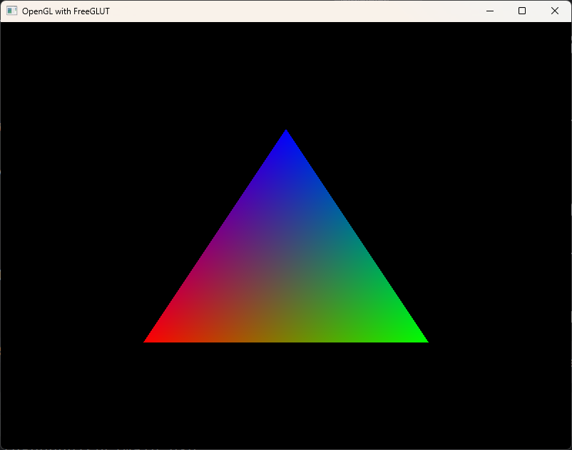

# What is this?
This is a minimal example repository to start programming using (legacy) OpenGL.

## What do I need?
You will have to have CMake installed on your system (version 3.26 or higher).

On Linux, you will need to install the freeglut dev library like so:
```bash
sudo apt install freeglut3-dev
```

## How to Compile?
Open a shell in the main directory of this repository. Then enter:
```bash
mkdir build
cd build
cmake ..
cmake --build .
```
CMake will then compile the project and its dependencies and create an executable for you.

When you run that executable (`main.exe` or just `main` on Linux), you should see something similar to this:
