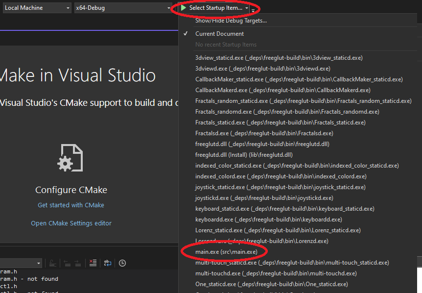

# What is this?
This is a minimal example repository to start programming using (legacy) OpenGL.

## What do I need?
You need the following:
* CMake (version 3.26 or higher)
* a working C++ compiler (e.g. GCC)
* *Linux only:* the freeglut dev library, install it like so:
    ```bash
    sudo apt install freeglut3-dev
    ```

## How to Compile and Run?

You can use CMake directly (just keep reading) or use an IDE like JetBrains CLion or Microsoft Visual Studio (see below).

Open a shell in the main directory of this repository. Then enter:
```bash
mkdir build
cd build
cmake ..
cmake --build .
```
CMake will then compile the project and its dependencies and create an executable (in the `src/` subfolder) for you.

When you run that executable (`main.exe` or just `main` on Linux), you should see something similar to this:


## Using JetBrains CLion

Open the folder of the repository, select the configuration like shown in the screenshot below and hit the play button.


## Using Microsoft Visual Studio

You can open the cloned repository ("open local folder") from the splash screen of Visual Studio. Then just select the correct startup item like shown in the screenshot and hit the play button.
